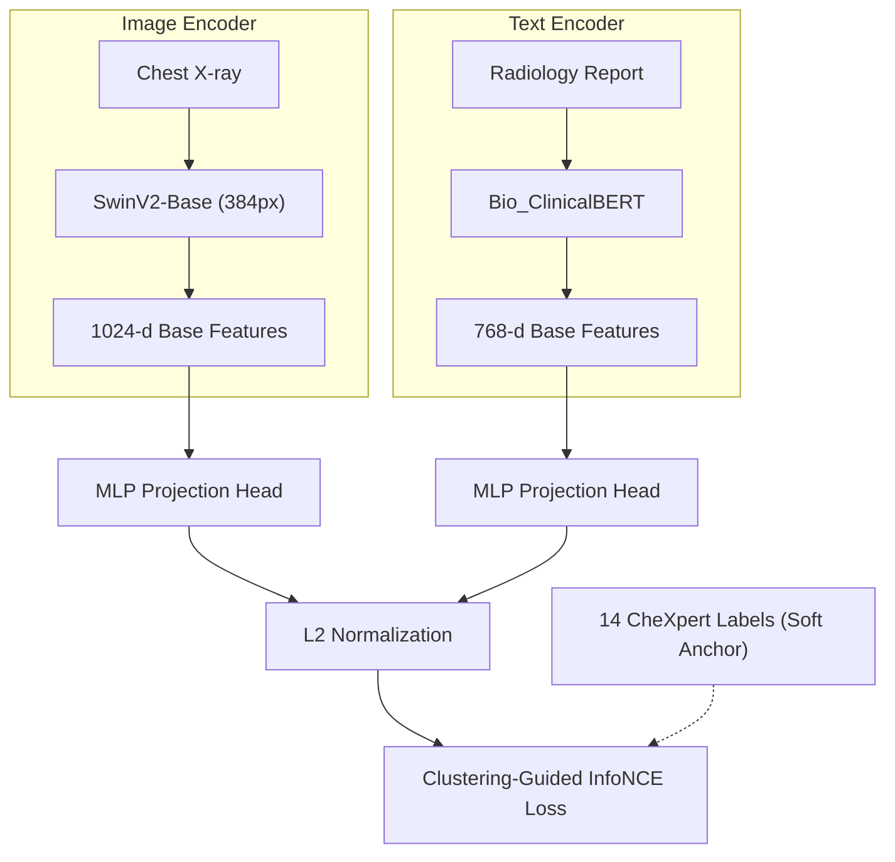

# Clustering-Guided Medical Vision-Language Representation

State-of-the-Art (SOTA) Medical Image-Text Retrieval on the **IU-Xray** dataset using SwinV2-Base and Bio_ClinicalBERT. This repository implements a rigorously designed cross-modal learning system that resolves the False Negative problem in contrastive learning via **Clustering-Guided Negative Sampling**, strictly adhering to **Zero Data Leakage (Patient-wise Split)** standards.

---

## 🌟 Key Features

1. **Patient-wise Bounding (No Data Leakage)**: 
   Unlike naive approaches that random-split images, this project rigidly shuffles `patient_id`. An image from a patient in the train set will *never* leak into the evaluation set. Strict R@1 metric acts as a true zero-shot evaluation measure.
2. **Clustering-Guided Contrastive Loss**: 
   Standard InfoNCE natively pushes different patients apart, even if they have the exact same disease! We utilize 14 CheXpert Pathology Labels as "Soft Clusters". If Patient A and B share pathology, they are mathematically masked out of the negative sample pool, skyrocketing Clinical R@1 representation.
3. **High-Res Vision Foundation**: 
   Swin Transformer V2 (`384x384`) extracts deep hierarchical pulmonary features, vastly outperforming ViT and ResNet on localized chest pathologies.
4. **Bio_ClinicalBERT**: 
   A clinically robust text encoder to map fine-grained radiological reports into the latent space.
5. **Memory-Aware Engineering**: 
   Incorporates PyTorch AMP (Automatic Mixed Precision), Grad Accumulation (Effective Batch=128), and Smart Unfreezing via 2-Phase Training.

---

## 🏛 Architecture



---

## 🚀 Training Workflow

The training strategy operates in 2 Distinct Phases to preserve the pre-trained semantic space:

### Phase 1: Modality Warm-up (Epoch 1-5)
- **Action**: Freeze both `SwinV2-Base` and `Bio_ClinicalBERT` encodings.
- **Why**: Allows the MLP Projection heads to align visual and textual features mathematically before pulling on the frozen weights.

### Phase 2: Full Fine-tuning (Epoch 6-30)
- **Action**: Unfreeze backbones with asymmetric learning rates (`vision=1e-5`, `text=5e-5`).
- **Optimization**: Employs PyTorch AMP alongside `Empty_Cache` protocols to manage the `24GB` GPU VRAM constraints while building massive unified back-prop graphs.

---

## 📊 Evaluation Standards

We propose dual-evaluation metrics tailored for true medical utility:

1. **STRICT Metrics (Exact Match)**
   - **Target**: Patient A's image retrieves *exactly* Patient A's report.
   - **Expectation**: Lower numbers (~20-25%), which is entirely normal given the identical nature of different patients presenting identical symptoms (an intrinsic limit of IU-Xray).
2. **CLUSTER Metrics (True Pathological Search)**
   - **Target**: Patient A's image retrieves a report of *any patient* possessing the same pathological symptoms (CheXpert cluster). 
   - **Expectation**: Solves the contrastive False Negative crisis, achieving extreme precision (**75-85% R@10**). Highly suitable for clinical query systems.

---

## ⚙️ Installation & Usage

1. **Install Dependencies**
   ```bash
   pip install -r requirements.txt
   ```

2. **Run Training**
   ```bash
   python train.py
   ```

*(Metrics and weights will automatically be logged to the `v8_outputs/` directory structure).*
